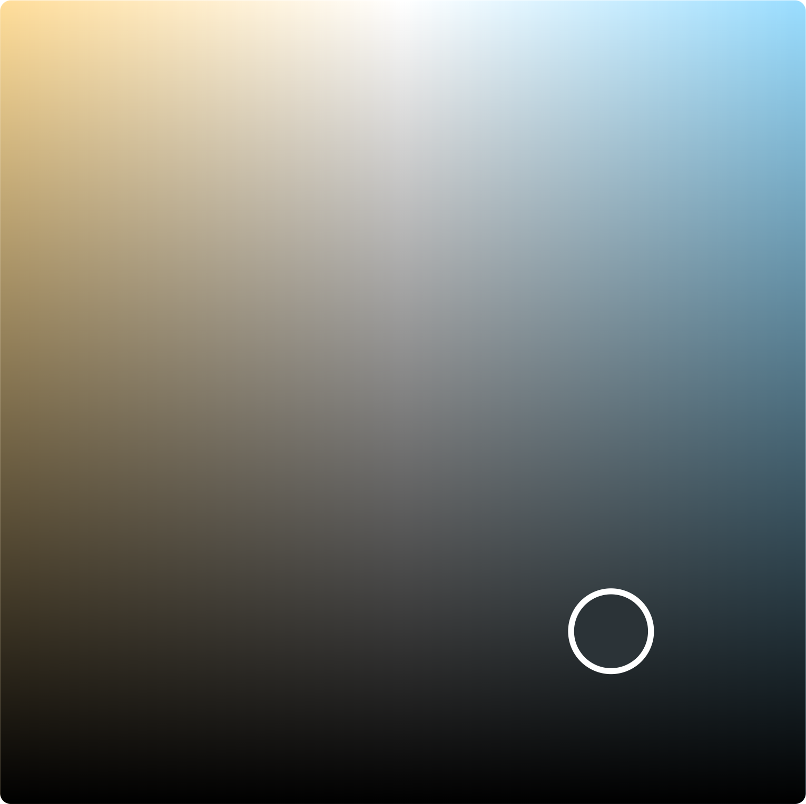

# @adrianjost/chooose

> A Line Chart as an input element

## About

I needed an intuitive picker to define an LEDs brightness and color temperature over the course of the day.

<p align="center">
  
</p>

## Usage

### with VueJS

Install the package:

```bash
npm i @adrianjost/chooose
```

or

```bash
yarn add @adrianjost/chooose
```

In your App:

```vue
<template>
	<Chooose v-model="data" :options="{}" />
</template>

<script>
import Chooose from "@adrianjost/chooose";

export default {
	components: {
		Chooose,
	},
	data() {
		return {
			data: [5, 5, 15, 50, 10, 5],
		};
	},
};
</script>
```

## API

### Props

You can customize the picker with the following props/attributes.

> When using the lib as a web component you must provide all attributes `JSON.stringify()`-ed.

| attribute | type | default value | description |
| --- | --- | --- | --- |
| `value` / `v-model` | Array, String | `[1,0]` | the current channel values, if provided as a String, this must be `JSON.parse()`-able |
| `options` | Object | `{}` | all your config goes in here |

#### Options

Available Attributes in the `options` prop:

| attribute | type | default value | description |
| --- | --- | --- | --- |
| `readOnly` | Boolean | `false` | should the user be able to move the marker? |
| `colorLeft` | String | `#fd9` | the color in the top left corner. Must be in the HEX Format with 3 or 6 digits. |
| `colorRight` | String | `#fd9` | the color in the top right corner. Must be in the HEX Format with 3 or 6 digits. |
| `marker.borderWidth` | Number | `2` | The border width of the active marker in px. |
| `marker.radius` | Number | `16` | The border radius including the borderWidth in px. |

You need more options? Please open an issue and I will do my best to implement it. Pull Requests are also welcome!
